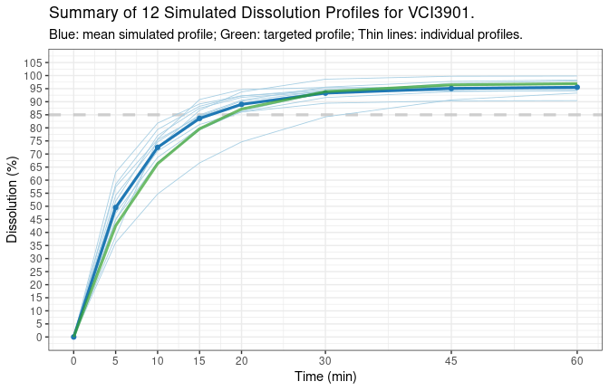
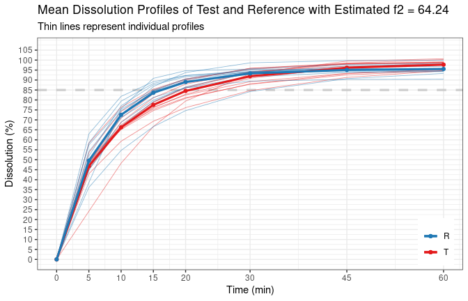
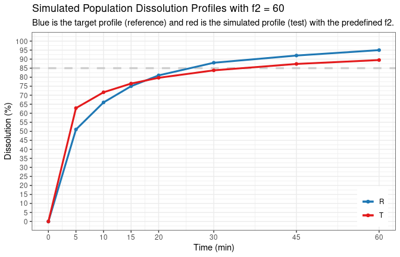

bootf2: Simulation and Comparison of Dissolution Profiles
================
2021-08-18

-   [Installation](#installation)
-   [Introduction](#introduction)
-   [Examples](#examples)
    -   [Function `sim.dp()`](#function-simdp)
    -   [Function `calcf2()`](#function-calcf2)
    -   [Function `sim.dp.byf2()`](#function-simdpbyf2)
    -   [Function `bootf2()`](#function-bootf2)
-   [Disclaimer](#disclaimer)
-   [References](#references)

<!-- README.md is generated from README.Rmd. Please edit that file -->

## Installation

-   To install the released version from CRAN:

``` r
install.packages("bootf2", repos = "https://cloud.r-project.org/")
```

-   To install the development version from Github, please install
    [Rtools](https://cran.r-project.org/bin/windows/Rtools/) for
    building R packages from sources if you use Windows, then

``` r
# Need devtools. if you don't have it, install.packages("devtools") 
devtools::install_github("zhengguoxu/bootf2")
```

## Introduction

<!-- badges: start -->
<!-- badges: end -->

The package `bootf2` was developed to compare the dissolution profiles
using bootstrap *f*<sub>2</sub> method, as recommended recently by
several regulatory
guidelines<sup>[1](#ref-EMA-2018-09-QA.MSD.DISSO)–[4](#ref-Mandula-2019-05-WS)</sup>.
Several additional functions were included later for the simulation of
the dissolution profiles.

Currently, there are four main functions in the package:

1.  `sim.dp()` to simulate dissolution profiles using mathematical
    models or multivariate normal distribution. See vignette [Simulation
    of Dissolution
    Profiles](https://cran.r-project.org/web/packages/bootf2/vignettes/sim.dp.html)
    for details.
2.  `calcf2()` to calculate similarity factor *f*<sub>2</sub> according
    to different regulatory rules. See vignette [Calculating Similarity
    Factor
    *f*<sub>2</sub>](https://cran.r-project.org/web/packages/bootf2/vignettes/calcf2.html)
    for details.
3.  `sim.dp.byf2()` to find a dissolution profile that, when compared to
    a given reference profile, has *f*<sub>2</sub> value equal to the
    predefined target *f*<sub>2</sub>. See vignette [Simulation of
    Dissolution Profiles with Predefined Target
    *f*<sub>2</sub>](https://cran.r-project.org/web/packages/bootf2/vignettes/sim.dp.byf2.html)
    for details.
4.  `bootf2()` to estimate the confidence intervals of *f*<sub>2</sub>s
    using bootstrap method. See vignette [Confidence Intervals of f2
    Using Bootstrap
    Method](https://cran.r-project.org/web/packages/bootf2/vignettes/bootf2.html)
    for details.

In addition to the vignettes for the main functions, some common topics
such as regulation rules are discussed in the vignette [Introduction to
bootf2](https://cran.r-project.org/web/packages/bootf2/vignettes/introduction.html).

The most basic usage is given below as a brief demonstration.

## Examples

### Function `sim.dp()`

The complete list of arguments are shown below. Read the function manual
with `?sim.dp` for more details.

``` r
dat <- sim.dp(tp, dp, dp.cv, model = c("Weibull", "first-order"),
              model.par = NULL, seed = NULL, n.units = 12L, product,
              max.disso = 100, ascending = FALSE, message = FALSE,
              time.unit = c("min", "h"), plot = TRUE,
              plot.max.unit = 36L)
```

For the most basic use, the function can be run without any user
provided arguments, e.g., `sim.dp()`. In such case, 12 units of
individual dissolution profiles will be simulated using Weibull model
with a typical sampling time points of 5, 10, 15, 20, 30, 45, and 60
min. A `seed` number will be randomly generated, if not provided by the
user, and included in the output for reproducibility purpose.

``` r
library(bootf2)
# simulation. simple as that. 
d.ref <- sim.dp(seed = 1234)
```

The output of `sim.dp()` is a list of at least 3 components:

1.  `sim.summary`: A *data frame* with summary statistics of all
    individual dissolution profiles.

``` r
print(d.ref$sim.summary)
#   product time       dp dp.cv sim.mean sim.median    sim.cv   sim.var   sim.sd
# 1 VCI3901    0  0.00000    NA  0.00000    0.00000  0.000000  0.000000 0.000000
# 2 VCI3901    5 35.91205    NA 42.59002   41.74175 19.312496 67.653855 8.225196
# 3 VCI3901   10 58.37878    NA 65.24386   64.63399 11.048803 51.964863 7.208666
# 4 VCI3901   15 72.55031    NA 77.95186   79.42119  8.856818 47.665970 6.904055
# 5 VCI3901   20 81.51082    NA 85.00156   86.16105  7.383728 39.391744 6.276284
# 6 VCI3901   30 90.78021    NA 91.34221   92.78433  4.956413 20.496418 4.527297
# 7 VCI3901   45 95.42728    NA 94.32405   95.06778  3.258574  9.447131 3.073618
# 8 VCI3901   60 96.61781    NA 95.21829   95.38719  2.752588  6.869471 2.620968
#    sim.min  sim.max sim.qt05 sim.qt25 sim.qt75 sim.qt95
# 1  0.00000  0.00000  0.00000  0.00000  0.00000  0.00000
# 2 28.86682 56.23244 30.08120 38.28761 48.65758 53.69296
# 3 48.29650 76.37401 54.49829 62.94728 69.54749 74.58668
# 4 60.03121 85.53969 66.92377 75.59784 82.76237 84.65364
# 5 68.43588 92.13902 75.32032 82.27256 88.85582 90.96216
# 6 79.25227 96.60286 84.06618 89.90644 93.51285 95.88751
# 7 87.54060 99.40223 88.90028 93.78673 95.48357 98.00911
# 8 90.36151 99.80318 90.94327 94.12407 96.65417 98.79344
```

1.  `sim.disso`: A *data frame* with all individual dissolution
    profiles.

``` r
print(d.ref$sim.disso)
#   time  unit.01  unit.02  unit.03  unit.04  unit.05  unit.06  unit.07  unit.08
# 1    0  0.00000  0.00000  0.00000  0.00000  0.00000  0.00000  0.00000  0.00000
# 2    5 42.44302 38.68705 47.76202 31.07478 28.86682 41.04047 40.98547 51.34429
# 3   10 64.34095 59.57248 68.16946 48.29650 63.68414 64.92703 61.81370 73.12431
# 4   15 76.12156 72.56313 79.54749 60.03121 83.92869 78.42522 74.02670 83.83484
# 5   20 82.53928 80.95304 86.33855 68.43588 92.13902 85.98356 81.47238 89.33110
# 6   30 88.00484 90.19166 93.22817 79.25227 95.30223 92.52769 89.05079 93.77081
# 7   45 90.01275 95.58009 96.86928 87.54060 95.45140 94.92385 92.93529 95.32524
# 8   60 90.36151 97.34724 97.96729 91.41926 95.45178 95.32260 94.01854 95.59138
#    unit.09  unit.10  unit.11  unit.12
# 1  0.00000  0.00000  0.00000  0.00000
# 2 43.93941 56.23244 51.61520 37.08931
# 3 69.44566 76.37401 69.85299 63.32513
# 4 82.40489 85.53969 79.70409 79.29489
# 5 88.69740 89.99927 85.58302 88.54620
# 6 93.04097 93.42686 91.70737 96.60286
# 7 94.07055 94.56556 95.21171 99.40223
# 8 94.15925 94.75433 96.42314 99.80318
```

1.  `sim.info`: A *data frame* with information of the simulation.

``` r
print(d.ref$sim.info)
#    fmax fmax.cv   mdt mdt.cv     beta beta.cv tlag tlag.cv seed n.units
# 1 97.03       3 10.87     30 0.993764      20    0       0 1234      12
#   max.disso   model time.unit
# 1       100 Weibull       min
```

Depending on the argument settings, there *might be* two additional
components:

4.  `model.par.ind`: A *data frame* of individual model parameters that
    are used to simulate the individual dissolution profiles if
    mathematical models are chosen for the simulation.

``` r
print(d.ref$model.par.ind)
#    fmax.ind   mdt.ind  beta.ind tlag.ind
# 1  90.43662  7.995749 0.9720844        0
# 2  98.28721 10.820746 0.8972171        0
# 3  98.51432  8.208926 0.8282050        0
# 4  95.37133 15.130249 0.8405575        0
# 5  95.45179  9.424652 1.6110909        0
# 6  95.40077  8.786133 1.0207750        0
# 7  94.47347  9.352365 0.9008715        0
# 8  95.65084  6.667725 0.9099505        0
# 9  94.16689  7.657771 1.0894384        0
# 10 94.79651  5.651917 0.8650227        0
# 11 97.21781  7.269654 0.7438644        0
# 12 99.86358  9.951453 1.1148230        0
```

5.  `sim.plot`: A plot if `plot = TRUE`.

``` r
print(d.ref$sim.plot)
```



Simple case like this might be useful in situations such as testing
other programs where data with certain format is needed. In general, to
have better controlled outcomes, argument `tp`, `model`, and `model.par`
should be provided.

### Function `calcf2()`

The complete list of arguments are shown below. Read the function manual
with `?calcf2` for more details. In addition, refer to the [Introduction
to
bootf2](https://cran.r-project.org/web/packages/bootf2/vignettes/introduction.html)
for detailed discussion on different regulatory requirements regarding
to the applicability of *f*<sub>2</sub>.

``` r
calcf2(test, ref, path.in, file.in, path.out, file.out,
       regulation = c("EMA", "FDA", "WHO", "Canada", "ANVISA"),
       cv.rule = TRUE, message = FALSE, min.points = 3L,
       f2.type = c("est.f2", "exp.f2", "bc.f2", "vc.exp.f2",
                   "vc.bc.f2", "all"), both.TR.85 = FALSE,
       digits = 2L, time.unit = c("min", "h"),  plot = TRUE,
       plot.start.time = 0, plot.max.unit = 24L)
```

The minimum required arguments are `test` and `ref`. Data can also be
read from an Excel file. For interactive use, such as the examples
below, the `test` and `ref` should be *data frames with the time as the
first column and individual profiles as the rest columns*. The
`sim.disso` data frame in the output of `sim.dp()` comes with the
correct format, as shown above. This is the base function used by
function `bootf2()`.

``` r
# simulate a test data
d.test <- sim.dp(seed = 100, plot = FALSE, message = TRUE)
# Dissolution data was generated using Weibull model, with the 
# following model parameters:
# - fmax      = 98.75
# - fmax.cv   = 3%
# - tlag      = 0
# - tlag.cv   = 0%
# - mdt       = 10.4
# - mdt.cv    = 30%
# - beta      = 0.787472
# - beta.cv   = 20%
# 
# Seed number used:  100

# calculate f2 with default settings
tmp.f2 <- calcf2(d.test$sim.disso, d.ref$sim.disso, message = TRUE)
# The f2 method was applied according to EMA's BE guideline.
# 
# Individual data was provided with option 'cv.rule = TRUE',
# therefore, CV has been calculated and checked accordingly.
# 
# Calculated mean and CV as follows:
# Time   Mean (T)   Mean (R)     CV (T)     CV (R) 
# 5         41.09      42.59      19.64      19.31 
# 10        59.69      65.24      13.12      11.05 
# 15        71.29      77.95       9.39       8.86 
# 20        79.00      85.00       7.10       7.38 
# ------------------------------------------------ 
# 30        88.00      91.34       4.82       4.96 
# 45        93.95      94.32       3.41       3.26 
# 60        96.35      95.22       2.55       2.75 
# ==================================
# Number of units for test is      : nt = 12
# Number of units for reference is : nr = 12
# 
# CV criteria fulfilled; therefore, f2 method can be applied.
# 
# The time points above the dashed line are used in f2 calculation.
# 
# Estimated f2 = 63.3
```



``` r
print(tmp.f2)
#   f2.type f2.value f2.tp d85at15 regulation cv.rule min.points
# 1  est.f2 63.29838     4      no        EMA    TRUE          3
```

When the conditions to apply *f*<sub>2</sub> are not fulfilled, the
function will stop and, depending on the details of non-compliance of
regulatory rules, show different error messages.

``` r
# simulate reference profile with CV% criterion not fulfilled  
d.ref2 <- sim.dp(seed = 456)

# output with error message
calcf2(d.test$sim.disso, d.ref2$sim.disso, message = TRUE)
# The f2 method was applied according to EMA's BE guideline.
# 
# Individual data was provided with option 'cv.rule = TRUE',
# therefore, CV has been calculated and checked accordingly.
# 
# Calculated mean and CV as follows:
# Time   Mean (T)   Mean (R)     CV (T)     CV (R) 
# 5         41.09      34.09      19.64      30.50 
# 10        59.69      56.34      13.12      20.10 
# 15        71.29      70.71       9.39      16.24 
# 20        79.00      79.66       7.10      13.48 
# 30        88.00      88.70       4.82       9.01 
# ------------------------------------------------ 
# 45        93.95      93.58       3.41       5.27 
# 60        96.35      95.33       2.55       3.75 
# ==================================
# Number of units for test is      : nt = 12
# Number of units for reference is : nr = 12
# 
# CV criteria not fulfilled; therefore, f2 method cannot be applied.
# Error in calcf2(d.test$sim.disso, d.ref2$sim.disso, message = TRUE): You should consider alternative methods such as bootstrap f2.
```

### Function `sim.dp.byf2()`

The complete list of arguments are shown below. Read the function manual
with `?sim.dp.byf2` for more details.

``` r
dat <- sim.dp.byf2(tp, dp, target.f2, seed = NULL, min.points = 3L,
                   regulation = c("EMA", "FDA", "WHO", "Canada", "ANVISA"),
                   model = c("Weibull", "first-order"), digits = 2L,
                   max.disso = 100, message = FALSE, both.TR.85 = FALSE,
                   time.unit = c("min", "h"), plot = TRUE, sim.dp.out,
                   sim.target = c("ref.pop", "ref.median", "ref.mean"),
                   model.par.cv = 50, fix.fmax.cv = 0, random.factor = 3)
```

Given any dissolution profile `dp` at time points `tp`, and target
*f*<sub>2</sub> value (e.g., `target.f2 = 55`), this function will find
another dissolution profile such that when the newly simulated profile
is compared to the `dp`, the calculated *f*<sub>2</sub> will be equal to
the target *f*<sub>2</sub>. If `target.f2` is provided as a range, such
as `target.f2 = c(54.95, 55.04)`, then the calculated *f*<sub>2</sub>
with simulated profile will be within this range.

``` r
# mean dissolution profile for tp
tp <- c(5, 10, 15, 20, 30, 45, 60)
dp <- c(51, 66, 75, 81, 88, 92, 95)

# find another profile with target f2 = 60
d.t2 <- sim.dp.byf2(tp, dp, target.f2 = 60, seed = 123, message = TRUE)
```



    # Obtained model parameters and calculated f2 are:
    #     model seed     fmax tlag      mdt      beta f2 f2.tp regulation
    # 1 Weibull  123 96.95502    0 4.424869 0.3611346 60     5        EMA
    # 
    # And the difference between simulated test and reference is:
    #   time ref     test   diff.tr
    # 1    0   0  0.00000  0.000000
    # 2    5  51 62.86075 11.860752
    # 3   10  66 71.62829  5.628286
    # 4   15  75 76.46007  1.460075
    # 5   20  81 79.66658 -1.333418
    # 6   30  88 83.78233 -4.217670
    # 7   45  92 87.33950 -4.660501
    # 8   60  95 89.48884 -5.511159

The model parameters in the output are more useful in simulation studies
since they can be used as initial model parameter input to the function
`sim.dp()` to simulate a large population of individual dissolution
profiles that have the known population *f*<sub>2</sub> value when
compared to target dissolution profile.

### Function `bootf2()`

The complete list of arguments are shown below. Read the function manual
with `?bootf2` for more details.

``` r
result <- bootf2(test, ref, path.in, file.in, path.out, file.out,
                 n.boots = 10000L, seed = 306L, digits = 2L, alpha = 0.05,
                 regulation = c("EMA", "FDA", "WHO", "Canada", "ANVISA"),
                 min.points = 1L, both.TR.85 = FALSE, print.report = TRUE,
                 report.style = c("concise",  "intermediate", "detailed"),
                 f2.type = c("all", "est.f2", "exp.f2", "bc.f2",
                             "vc.exp.f2", "vc.bc.f2"),
                 ci.type = c("all", "normal", "basic", "percentile",
                             "bca.jackknife", "bca.boot"),
                 quantile.type = c("all", as.character(1:9), "boot"),
                 jackknife.type = c("all", "nt+nr", "nt*nr", "nt=nr"),
                 time.unit = c("min", "h"), output.to.screen = FALSE,
                 sim.data.out = FALSE)
```

The minimum required arguments are dissolution profiles of `test` and
`ref`. The function can output many different 90% confidence intervals
for several *f*<sub>2</sub> estimators. With default settings, the
function prints all confidence intervals for all *f*<sub>2</sub>
estimators, and the result will be save in a text file.

``` r
# get test and reference data set with correct format
test <- d.test$sim.disso
ref  <- d.ref$sim.disso

# use most default settings (output all) but small number of bootstrap
# to have shorter run time for the example. default n.boots = 10000L
t_vs_r <- bootf2(test, ref, n.boots = 100L, print.report = FALSE,
                 output.to.screen = TRUE)
# =================================================================
# |                                                               |
# |  Comparison of Dissolution Profiles by Bootstrap f2 Method.   |
# |_______________________________________________________________|
# |                                                               |
# | Smimilarity Criterion:                                        |
# | ----------------------                                        |
# |     To conclude similarity, the lower limit of 90% confidence |
# | interval should be greater than or equal to 50.               |
# |                                                               |
# =================================================================
# 
# =================================================================
# * T & R dissolved more than 85% at 15 min in original data : NO |
# =================================================================
# 
# ============================================
# |              Main Results:               |
# |  f2 and Its Confidence Intervals (CI)s   |
# ============================================
# 
# -------------------------------
# * Estimated f2 Values (est.f2)
# -------------------------------
#   - with original data                        :   63.3
#   - with original data (by Jackknife, nt+nr)  :   63.8
#   - with original data (by Jackknife, nt*nr)  :   64.29
#   - with original data (by Jackknife, nt=nr)  :   64.37
#   - with bootstrapped data (Mean)             :   65.22
#   - with bootstrapped data (Median)           :   64.13
# 
# -----------------------
# * Confidence Intervals
# -----------------------
#           Types of         Lower   Upper
#     Confidence Intervals   <----------->
#                   Normal   45.80   76.95
#                    Basic   44.15   73.55
#      Percentile (Type 1)   53.02   82.24
#      Percentile (Type 2)   53.28   82.35
#      Percentile (Type 3)   53.02   82.24
#      Percentile (Type 4)   53.02   82.24
#      Percentile (Type 5)   53.28   82.35
#      Percentile (Type 6)   53.05   82.44
#      Percentile (Type 7)   53.50   82.25
#      Percentile (Type 8)   53.20   82.38
#      Percentile (Type 9)   53.22   82.37
#        Percentile (boot)   53.05   82.44
#   BCa (jackknife, nt+nr)   47.56   81.00
#   BCa (jackknife, nt*nr)   47.35   80.91
#   BCa (jackknife, nt=nr)   47.08   80.80
#               BCa (boot)   49.37   81.73
# ------------------------------------------------------------
#   Out of 100 bootstrapped data sets,
#   - Number of f2 calculated with 1 time point             :   0
#   - Number of f2 calculated with 2 time point             :   0
#   - Number of f2 cannot be calculated (NA)                :   0
#   - Number of T and R dissolving more than 85% at 15 min  :   0
# ------------------------------------------------------------
# ______________________________________________________________________
# 
# ------------------------------
# * Expected f2 Values (exp.f2)
# ------------------------------
#   - with original data                        :   60.53
#   - with original data (by Jackknife, nt+nr)  :   60.89
#   - with original data (by Jackknife, nt*nr)  :   61.24
#   - with original data (by Jackknife, nt=nr)  :   61.3
#   - with bootstrapped data (Mean)             :   61.73
#   - with bootstrapped data (Median)           :   62.05
# 
# -----------------------
# * Confidence Intervals
# -----------------------
#           Types of         Lower   Upper
#     Confidence Intervals   <----------->
#                   Normal   48.25   70.41
#                    Basic   48.74   69.65
#      Percentile (Type 1)   51.40   71.78
#      Percentile (Type 2)   51.56   72.06
#      Percentile (Type 3)   51.40   71.78
#      Percentile (Type 4)   51.40   71.78
#      Percentile (Type 5)   51.56   72.06
#      Percentile (Type 6)   51.41   72.32
#      Percentile (Type 7)   51.71   71.81
#      Percentile (Type 8)   51.51   72.15
#      Percentile (Type 9)   51.53   72.13
#        Percentile (boot)   51.42   72.32
#   BCa (jackknife, nt+nr)   45.03   70.53
#   BCa (jackknife, nt*nr)   45.10   70.55
#   BCa (jackknife, nt=nr)   44.98   70.51
#               BCa (boot)   45.03   70.53
# ------------------------------------------------------------
#   Out of 100 bootstrapped data sets,
#   - Number of f2 calculated with 1 time point             :   0
#   - Number of f2 calculated with 2 time point             :   0
#   - Number of f2 cannot be calculated (NA)                :   0
#   - Number of T and R dissolving more than 85% at 15 min  :   0
# ------------------------------------------------------------
# ______________________________________________________________________
# 
# -----------------------------------
# * Bias-Corrected f2 Values (bc.f2)
# -----------------------------------
#   - with original data                        :   67.02
#   - with original data (by Jackknife, nt+nr)  :   67.82
#   - with original data (by Jackknife, nt*nr)  :   68.65
#   - with original data (by Jackknife, nt=nr)  :   68.78
#   - with bootstrapped data (Mean)             :   67.95
#   - with bootstrapped data (Median)           :   65.61
# 
# -----------------------
# * Confidence Intervals
# -----------------------
#           Types of         Lower   Upper
#     Confidence Intervals   <----------->
#                   Normal   47.10   85.09
#                    Basic   42.05   80.87
#      Percentile (Type 1)   54.53   91.49
#      Percentile (Type 2)   54.53   91.49
#      Percentile (Type 3)   54.53   89.91
#      Percentile (Type 4)   52.89   90.54
#      Percentile (Type 5)   54.54   91.33
#      Percentile (Type 6)   53.09   92.02
#      Percentile (Type 7)   54.57   90.62
#      Percentile (Type 8)   54.32   91.57
#      Percentile (Type 9)   54.48   91.51
#        Percentile (boot)   53.17   91.99
#   BCa (jackknife, nt+nr)   54.53   92.61
#   BCa (jackknife, nt*nr)   53.49   92.11
#   BCa (jackknife, nt=nr)   53.88   92.26
#               BCa (boot)   54.60   93.66
# ------------------------------------------------------------
#   Out of 100 bootstrapped data sets,
#   - Number of f2 calculated with 1 time point             :   0
#   - Number of f2 calculated with 2 time point             :   0
#   - Number of f2 cannot be calculated (NA)                :   8
#   - Number of T and R dissolving more than 85% at 15 min  :   0
# ------------------------------------------------------------
# ______________________________________________________________________
# 
# ----------------------------------------------------
# * Variance-corrected Expected f2 Values (vc.exp.f2)
# ----------------------------------------------------
#   - with original data                        :   60.53
#   - with original data (by Jackknife, nt+nr)  :   60.87
#   - with original data (by Jackknife, nt*nr)  :   61.21
#   - with original data (by Jackknife, nt=nr)  :   61.26
#   - with bootstrapped data (Mean)             :   61.54
#   - with bootstrapped data (Median)           :   61.98
# 
# -----------------------
# * Confidence Intervals
# -----------------------
#           Types of         Lower   Upper
#     Confidence Intervals   <----------->
#                   Normal   48.60   70.43
#                    Basic   49.07   69.66
#      Percentile (Type 1)   51.37   70.98
#      Percentile (Type 2)   51.49   71.51
#      Percentile (Type 3)   51.37   70.98
#      Percentile (Type 4)   51.37   70.98
#      Percentile (Type 5)   51.49   71.51
#      Percentile (Type 6)   51.39   71.99
#      Percentile (Type 7)   51.60   71.03
#      Percentile (Type 8)   51.46   71.67
#      Percentile (Type 9)   51.47   71.63
#        Percentile (boot)   51.39   71.98
#   BCa (jackknife, nt+nr)   44.93   70.12
#   BCa (jackknife, nt*nr)   44.99   70.14
#   BCa (jackknife, nt=nr)   44.88   70.08
#               BCa (boot)   44.88   70.09
# ------------------------------------------------------------
#   Out of 100 bootstrapped data sets,
#   - Number of f2 calculated with 1 time point             :   0
#   - Number of f2 calculated with 2 time point             :   0
#   - Number of f2 cannot be calculated (NA)                :   0
#   - Number of T and R dissolving more than 85% at 15 min  :   0
# ------------------------------------------------------------
# ______________________________________________________________________
# 
# ----------------------------------------------------
# * Variance- and Bias-Corrected f2 Values (vc.bc.f2)
# ----------------------------------------------------
#   - with original data                        :   67.03
#   - with original data (by Jackknife, nt+nr)  :   67.87
#   - with original data (by Jackknife, nt*nr)  :   68.74
#   - with original data (by Jackknife, nt=nr)  :   68.86
#   - with bootstrapped data (Mean)             :   68.48
#   - with bootstrapped data (Median)           :   66.01
# 
# -----------------------
# * Confidence Intervals
# -----------------------
#           Types of         Lower   Upper
#     Confidence Intervals   <----------->
#                   Normal   45.50   85.65
#                    Basic   39.60   80.75
#      Percentile (Type 1)   54.69   94.30
#      Percentile (Type 2)   54.69   94.30
#      Percentile (Type 3)   54.69   90.50
#      Percentile (Type 4)   53.02   92.02
#      Percentile (Type 5)   54.69   93.92
#      Percentile (Type 6)   53.23   94.47
#      Percentile (Type 7)   54.72   92.21
#      Percentile (Type 8)   54.48   94.32
#      Percentile (Type 9)   54.63   94.30
#        Percentile (boot)   53.31   94.46
#   BCa (jackknife, nt+nr)   54.65   94.62
#   BCa (jackknife, nt*nr)   53.49   94.48
#   BCa (jackknife, nt=nr)   53.59   94.49
#               BCa (boot)   54.76   97.00
# ------------------------------------------------------------
#   Out of 100 bootstrapped data sets,
#   - Number of f2 calculated with 1 time point             :   0
#   - Number of f2 calculated with 2 time point             :   0
#   - Number of f2 cannot be calculated (NA)                :   8
#   - Number of T and R dissolving more than 85% at 15 min  :   0
# ------------------------------------------------------------
# ______________________________________________________________________
# 
# ============================================
# | Function Settings and System Information |
# ============================================
# 
# ---------------------
# * Function Settings
# ---------------------
#   - test              :   test
#   - ref               :   ref
#   - n.boots           :   100
#   - seed              :   306
#   - digits            :   2
#   - alpha             :   0.05 (90% CI)
#   - regulation        :   EMA
#   - min.points        :   1
#   - both.TR.85        :   FALSE
#   - print.report      :   FALSE
#   - report.style      :   concise (not used)
#   - f2.type           :   all
#   - ci.type           :   all
#   - quantile.type     :   all
#   - jackknife.type    :   all
#   - time.unit         :   min
#   - output.to.screen  :   TRUE
#   - sim.data.out      :   FALSE
#   - path.in           :   Not provided
#   - file.in           :   Not provided
#   - path.out          :   Not provided
#   - file.out          :   Not provided
# 
# ---------------------
# * System Information
# ---------------------
#   - OS Platform             :   x86_64-pc-linux-gnu (64-bit)
#   - OS Name and Release     :   Ubuntu 20.04.2 LTS
#   - Machine Node Name       :   MyHomeLinuxPC
#   - User Name               :   zhengguo
#   - Time Zone               :   Europe/Madrid
#   - R Version               :   4.1.1 (2021-08-10)
#   - Package bootf2 Version  :   0.4.0
# ______________________________________________________________________
```

The output of the `bootf2()` is a *list* containing: 1. `boot.ci`: A
*data frame* of bootstrap *f*<sub>2</sub> confidence intervals. 1.
`boot.f2`: A *data frame* of all individual *f*<sub>2</sub> values for
all bootstrap data sets. This can be used to make plots for visual
presentation. 1. `boot.info`: A *data frame* with detailed information
of bootstrap for reproducibility purpose, such as all arguments used in
the function, time points used for calculation of , and the number of
`NA`s. 1. `boot.summary`: A *data frame* with descriptive statistics of
the bootstrap *f*<sub>2</sub>.

And depending on the function settings, it might contains `boot.t` and
`boot.r`, lists of all individual bootstrap data sets for the test and
reference products.

## Disclaimer

***Despite the best efforts the author has put into, the package is
offered without any guarantee of accuracy and absolutely no warranty.
Validation of the package, especially when it is used in regulatory
field, is the responsibility of the users. The author accept absolutely
no liability for any financial loss or risk to public health resulting
from the use of this package.***

## References

<div id="refs" class="references csl-bib-body">

<div id="ref-EMA-2018-09-QA.MSD.DISSO" class="csl-entry">

<span class="csl-left-margin">(1) </span><span
class="csl-right-inline">European Medicines Agency. Question and answer
on the adequacy of the Mahalanobis distance to assess the comparability
of drug dissolution profiles
<https://www.ema.europa.eu/en/documents/scientific-guideline/question-answer-adequacy-mahalanobis-distance-assess-comparability-drug-dissolution-profiles_en.pdf>
(accessed 2018 -12 -04).</span>

</div>

<div id="ref-Davit-2013-03-BA" class="csl-entry">

<span class="csl-left-margin">(2) </span><span
class="csl-right-inline">Davit, B. M.; Stier, E.; Jiang, X.; Anand, O.
Expectations of the US-FDA Regarding Dissolution Data in Generic Drug
Regulatory Submissions. *Biopharma Asia* **2013**, *2* (2).</span>

</div>

<div id="ref-Lum-2019-05-WS" class="csl-entry">

<span class="csl-left-margin">(3) </span><span
class="csl-right-inline">Lum, S. Health Canada’s Current Practice and
Challenges in the Evaluation of Dissolution Profile Comparisons in
Support of Minor/Moderate Product Quality Changes: Case Studies. In *In
vitro dissolution profiles similarity assessment in support of drug
product quality: What, how, and when*; 2019.</span>

</div>

<div id="ref-Mandula-2019-05-WS" class="csl-entry">

<span class="csl-left-margin">(4) </span><span
class="csl-right-inline">Mandula, H. Rational Statistical Analysis
Practice in Dissolution Profile Comparison: FDA Perspective. In *In
vitro dissolution profiles similarity assessment in support of drug
product quality: What, how, and when*; 2019.</span>

</div>

</div>
